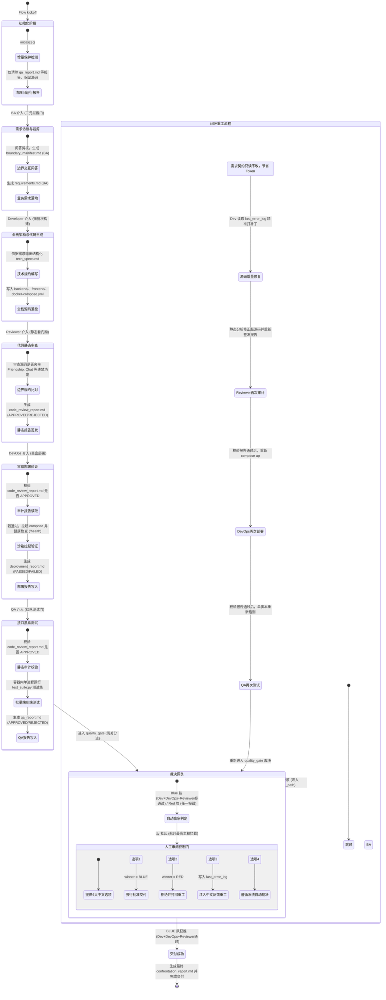

# 虚拟研发中心 (Virtual R&D Center)：从 0 到 1 打造 AI 软件工厂

> **演讲人**：航玮
> **主题**：如何用“确定性的工程学契约”对冲“大模型的不确定性”，打造工业级智能软件流水线。

---

## 0. 背景：为什么单体大模型无法胜任“真正的研发”？

大家好。在开始今天的技术分享前，我想先请大家思考一个场景：
> 为什么你让 ChatGPT/Claude 帮你写个简单的“贪吃蛇”或“记事本”游戏，它几秒钟就能搞定；但当你让它去研发一个**包含用户鉴权、数据库迁移、多容器部署、前端响应式 UI 以及端到端测试的社交系统（MVP）**时，它写着写着就丢三落四、逻辑雪崩，甚至完全停滞？

在过去几个月深度调试 AI 自动化的实战中，我总结出单体 LLM 在面对中大型软件研发时的**三个致命弱点**：

1. **“上下文漂移”与 Token 内存雪崩**：当代码文件和讨论链路拉长，AI 的 Context 塞满了历史碎屑。它在写第 10 个文件时，已经忘记了第 1 个文件里定义的数据库字段，导致“上下游接口南辕北辙”。
2. **“过度热心”的幻觉加成**：AI 默认是偏向迎合人类的。你让它写一个极简 MVP，它在写代码时会私自加上 Redis 缓存、CDN 加速、甚至推荐算法，直接导致系统架构在起步阶段就复杂性失控、无法交付。
3. **对“物理环境”的彻底盲目**：大模型可以通过训练数据背出成千上万行 Docker 指令，但它在运行时不知道 Windows 的盘符怎么拼、不知道端口是否被占用，更不知道容器拉起需要 5 秒的健康等待期。

因此，我做这个项目的核心初衷是：**我们不能指望一个“聊天机器人”去写软件，我们需要的是一个“纪律严明的 AI 软件工厂”**。

---

## 1. 核心底座：CrewAI 多智能体框架协同哲学

在搭建这套研发中心时，我们选择 **CrewAI** 作为智能体的底层编排底座。为什么不是原生的 LangChain 或 AutoGPT？因为 CrewAI 的核心哲学是 **Role-Playing（角色扮演）**。

### 1.1 声明式配置：角色与任务的彻底解耦
CrewAI 强制要求通过 YAML 格式声明式地配置 Agent 的 Backstory（背景故事）、Goal（目标）以及 Task 的 Expected Output（期望输出）。
* **`agents.yaml`**：定义智能体的性格、边界、不可逾越的底线。
* **`tasks.yaml`**：定义任务的物理交付物。

> [!NOTE]
> **职责越单一，AI 越聪明。** 通过 YAML 强行把一个庞大的 LLM “压缩”进一个窄小而专业的职责管道中。上下游 Agent 绝对禁止通过“聊天”进行越权协作，而是强制通过落盘的物理文件传递接力棒。

### 1.2 CrewAI 的 "Skill"（智能体技能）系统
在 CrewAI 中，我们将 Agent 的能力原子化为一组 **Skill（工具集）**：
* **Task-Specific Tools（任务级专用工具）**：工具可以直接绑定在 Task 上，限制该任务执行时的工具调用范围，防止 AI 滥用工具。
* **Pydantic 结构化输出**：任务的输出不只是纯文本，我们定义了 Pydantic Schema，强制要求 AI 必须以严格的 JSON 格式或指定的 Markdown 段落交付，从而让下一个 Agent 可以通过物理 Parser 直接读取，避免“聊天式”的模糊对接。
* **Self-Reflect Reasoning Loop（自省推理环）**：通过开启 `reasoning=True`，智能体在输出前会先在 Scratchpad 中进行“思考-行动-观察-修正”的多次迭代，极大地提升了决策正确率。

---

## 2. 软硬件协同：智能研发中心的物理架构

我们的虚拟研发中心采用 **Agent 矩阵 ── Flow 级全局状态机 ── Tools 物理接口** 三层架构。

```
+-----------------------------------------------------------------------+
|                       Flow 级全局状态机 (Event & State)               |
|            [Initialize] --> [MVP Path] --> [Quality Gate]             |
+-----------------------------------------------------------------------+
      | (调度)                                         | (自愈重工)
      v                                                v
+-----------------------------+                  +----------------------+
|  Blue Team (建设者部队)      |                  |  Red Team (毁灭者部队) |
|  - BA (业务分析师)          |  <-- 对抗协作 -->  |  - Code Reviewer     |
|  - Fullstack Dev (全栈开发) |                  |    (代码审计专家)    |
|                             |                  |  - DevOps (运维专家) |
|                             |                  |  - QA (接口质检专家) |
+-----------------------------+                  +----------------------+
      |                                                |
      +------------------------+-----------------------+
                               | (调用 API / 物理读写)
                               v
+-----------------------------------------------------------------------+
|                          Tools 物理接口层                              |
|   - ProjectScaffolderTool (路径拦截代码写入)                            |
|   - DockerMCPTool (Docker Compose 物理沙箱控制)                         |
|   - CheckpointValidatorTool / FileReadTool (物理验证与盘符读取)         |
+-----------------------------------------------------------------------+
```

### 2.1 Agent 阵营：高拟真红蓝对抗部队 (5 智能体配置)
为了兼顾开发效率、API 成本与协同智商，我们精简并确立了 **5 人核心智能体矩阵**，划分为两大对抗阵营：

* **蓝色建设部队（Blue Team）**：
  * **BA (业务分析师) ── 需求超纲拦截者**：负责边界拦截与交互式访谈，进行“是/否”问答剪枝，强行抹除超出 MVP 范围的幻觉功能，输出 `boundary_manifest.md` 与 `requirements.md`。
  * **Fullstack Dev (全栈开发) ── 架构规划与全栈生成器**：根据需求进行架构设计，输出 `tech_specs.md`，并在微批次下物理落盘 Backend（FastAPI）与 Frontend（Vanilla JS）的全部源码。
* **红色毁灭部队（Red Team）**：
  * **Code Reviewer (代码审计专家) ── 静态安全看门狗**：在代码落盘后、运行部署前，立即执行静态分析，逐行对比边界清单，一字不差地签发 `code_review_report.md` (APPROVED/REJECTED)。
  * **DevOps (运维专家) ── 容器黑盒启动器**：纯粹的物理验证者。它读取 Reviewer 报告，若失败则拒绝部署；若成功，则执行 `docker compose up -d` 部署验证并写出 `deployment_report.md` (PASSED/FAILED)。
  * **QA Engineer (质检专家) ── 端到端接口红队攻击者**：利用 `test_suite.py` 对容器运行态进行 E2E 接口黑盒测试，确认无技术故障后写出 `qa_report.md` (APPROVED/REJECTED)。

### 2.2 Flow 级全局状态机：脱离线性编排的自愈体
传统的 Multi-Agent 只能跑完 Task A 再跑 Task B，一旦中间出错，整个进程崩溃。
我们引入了 **Flow 级状态机**（基于 CrewAI Flow）：
* 它是**非线性**的。
* 它是**事件监听导向**的（使用 `@listen`、`@router` 控制路由）。
* 它拥有 **Split-Phase Self-Healing（分段断点重工自愈）**：一旦 QA 或 DevOps 抛出非 APPROVED 判定，状态机自动路由到 `rework_path`，唤醒 Rework Crew。重工流程会**自动跳过昂贵的 BA 需求聊天阶段**，直接锁定已落盘的代码，召集 Dev、Reviewer、DevOps、QA 在物理沙箱中进行局部的“开发-审计-部署-测试”断点修复，直至完全通过。

### 2.3 Tools 物理接口：剥夺 AI 自由的路径防炸膛
大模型直接操作操作系统会导致灾难，我们必须构建“钢铁铁轨”：
* **`ProjectScaffolderTool`**：内建物理拦截器（Iron-Cage）。无论 AI 输入何种绝对路径或相对路径，工具在底层通过 Anchor 强制重定向至 `output/{project_subdir}`。
* **`DockerMCPTool`**：将复杂的 `docker compose` 指令集封装为纯粹的底层 SDK 调用，杜绝 AI 自主拼写命令时产生语法炸膛。
* **`CheckpointValidatorTool`**：强制 Agent 必须先在 OS 上做 `os.path.exists()` 物理校验，再调用 `read`。**“不要相信 Context 里的幻觉，永远以磁盘物理状态为唯一真理。”**

---

## 3. MVP 流程全景剖析与状态转移图

我们的工厂不是在聊天，而是在运转一个**高度精密的状态机**。下面是该状态机运行的完整生命周期：



---

## 4. MVP 设计中的五大“工程化硬化思维”

在这套系统的多次迭代中，我们沉淀出了五种对抗大模型不确定性的**顶级工程学硬化思维**：

### 4.1 需求超纲的“物理拦截门”（BA 物理防区与静态审查）
AI 在接收任务时，天然地喜欢扩充需求。为了拦截这种意图膨胀，我们采取了“前堵后截”的闭环策略：
* **前堵**：BA 智能体在最前端生成 `boundary_manifest.md`，明确写入 **BANNED FUNCTIONAL ENTITIES（违禁功能清单）**（如：不允许出现好友、点赞等任何二级功能）。
* **后截**：代码生成后，**Code Reviewer 静态看门狗**会拿着这份清单对全栈源码进行**逐个字符的静态红队匹配**，一旦发现违禁路由或接口，立即在 `code_review_report.md` 中写入 `REJECTED`。DevOps 和 QA 检测到 REJECTED 后会直接拒绝部署与测试。这保证了 AI 始终在极简 MVP 的铁轨上运行。

### 4.2 钢铁断点契约（Steel-Contract）
> **核心原则：上下游 Agent 绝对禁止通过“聊天/Context”进行协作！**

如果让 BA 聊着天把需求告诉 Dev，Token 数量会呈指数级爆炸，代码生成质量会光速退化。
* 我们的做法是：BA 必须将规格书以 **物理文件（`requirements.md`）** 形式写入磁盘。
* 下游的 Dev 启动时，其 Context 极其干净（`Context: []`），只被赋予读盘工具，通过强力物理读盘获取图纸。
* 这种**“以磁盘物理文件为唯一信源的断点契约模式”**，优雅地切断了 Token 的膨胀链条，保证了超长开发链路下的代码智商不滑坡。

### 4.3 增量源码保护机制（Smart Incremental Protection）
在自动化重工（Rework）中，最忌讳的是“推倒重来”。如果第二轮重工时，系统把第一轮里人类手动微调的精美前端页面和后端业务代码直接 wipe 掉，那这个系统永远无法达到生产级。
* 我们重构了 Flow 初始化函数。启动新轮次时，**系统绝对不执行 `shutil.rmtree` 整个源码目录**。
* 它会采用 **Smart Incremental Protection（智能增量保护）**：仅清除上轮产生的验证报告（`qa_report.md`、`deployment_report.md`、`code_review_report.md`），而 100% 完好地保留 `backend/` 和 `frontend/` 物理源码。
* Rework 阶段，Developer 只是读取错误日志与 Reviewer 的整改清单，以“打补丁”的形式精准修改出错的代码行。这真正实现了**“人机协同的物理资产累积”**。

### 4.4 航玮最高主权交互闸门（Interactive Human Gate）
在追求全自动化的同时，不能陷入“AI 自说自话死循环”的黑盒陷阱。
* 我们在 Flow 路由层中重构设计了 `_interactive_user_gate`：
* 当检测到终端有 TTY 输入时，自动拦截状态转移，挂起全局线程。
* 终端弹起高度 Premium 的**全中文人机协作菜单**。作为研发中心总指挥，你可以选择“强行通过”、“直接打回”，甚至直接通过终端“打入一段中文修改建议”（如：“把 sessions_store 提取到全局独立的 module 中以消除循环导入”）。
* 这段话会被系统以高优上下文形式喂给下一次重工的 Dev Agent，实现了**“人类意志在智能体开发中的瞬间锚定”**。

### 4.5 性能与迭代极限优化（Iteration Optimization Rule）
在 QA 进行 API 端到端黑盒测试时，如果让 QA 代理一次又一次地调用命令行工具执行 `curl` 请求去测 10 几个接口，智能体会瞬间耗尽其 30 次的 `max_iter`（最大工具调用步数限制）并被框架强行掐死。
* **硬化对策**：我们在任务配置中写入了**性能极限优化规约**。
* 引导 QA 代理在执行测试时，**不要发 curl**，而是编写一个单体的 `test_suite.py` 自动化测试脚本写入容器。
* 随后调用 `DockerMCPTool` 执行 `python test_suite.py`，**仅通过一次网络/进程交互，便一次性拿回所有测试断言数据**。
* 这种“一弹发多靶”的脚本化执行，把 QA 环节的工具交互次数从 30+ 次暴降到 **1 次**，彻底终结了 Max Iteration 卡死！

---

## 5. 展望：大模型应用开发的未来新范式

在完成这套虚拟研发中心的搭建和无数轮实战调试后，我对于未来 AI 时代的应用开发得出了以下三个深刻结论：

### 5.1 程序员角色的本质转变：从“写代码”到“定契约”
未来的优秀软件工程师，其核心竞争力不再是手敲键盘的速度或对某些偏门 API 的记忆力，而是 **“定义契约与构建边界的能力”**。
* 你必须知道如何将业务需求裁剪为极致内聚的 MVP。
* 你必须知道如何在 YAML 中定义严丝合缝的 expected output。
* 你必须知道如何在物理系统边界架设红蓝对抗的校验铁轨。
大模型负责不确定性（生成），而你负责确定性（契约）。

### 5.2 从 Prompt Engineering 走向 Flow Engineering
单靠写一段精美、冗长的 System Prompt（提示词工程）已经无法突破单体模型的天花板。
未来的主流开发范式一定是 **Flow Engineering（工作流/状态机工程）**：
* 将复杂的研发逻辑拆解为状态机节点。
* 每一个节点职责极度单一，由专属 Agent 配合高内聚 Tool 完成物理产出。
* 节点之间通过物理文件或结构化协议（Pydantic Schema）进行数据流转。
* 允许状态自动回滚、局部重工和人工介入。

### 5.3 物理工具（MCP）是 AI 智能体的“感官与四肢”
没有物理工具的 Agent 只是空中楼阁。未来的 AI 应用开发，很大一部分工作是在为 AI 编写和维护高度安全的 **MCP 物理控制接口**。
* 用 Docker 沙箱保障安全性。
* 用绝对路径拦截保障稳定性。
* 用健康状态轮询保障运行时健康。

只要我们用**人类过去数十年沉淀出的优秀工程学经验**，去给大模型搭建起一条“不能越界的轨道”，AI 就能从一个“写代码的玩具”，真正蜕变为一个**源源不断、日夜不停生产数字工业资产的超级软件工厂**。

谢谢大家！
